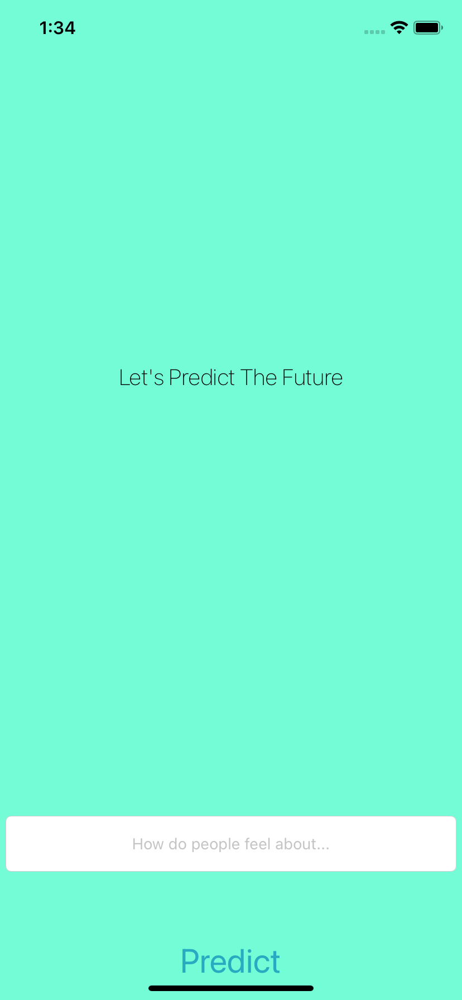
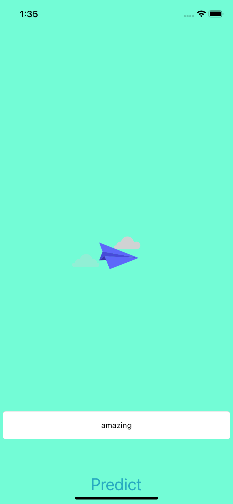
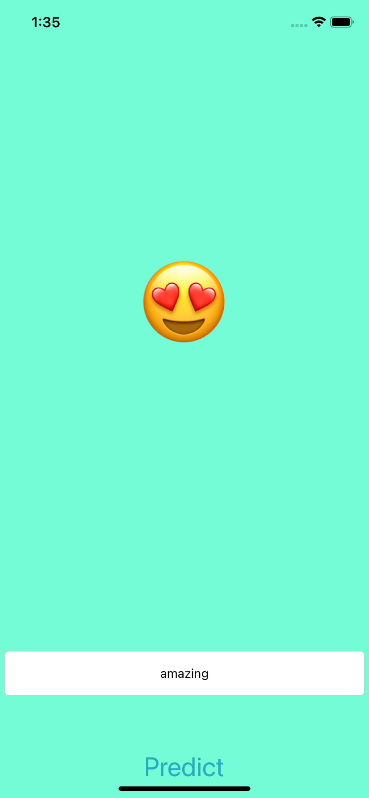
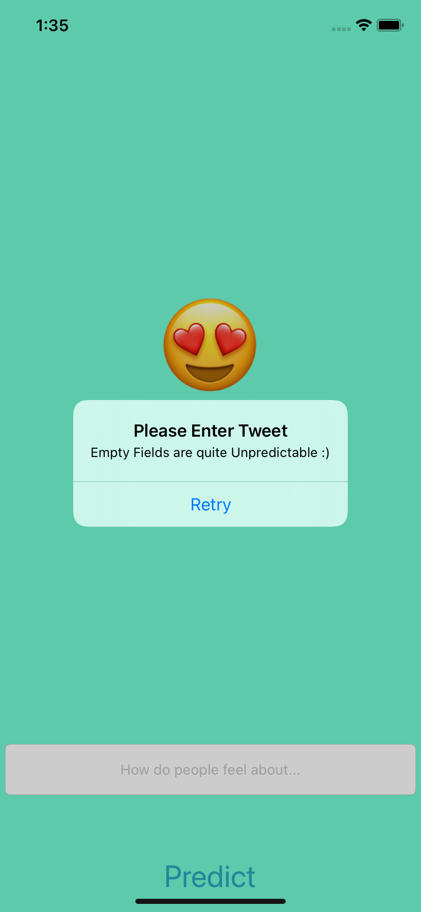

#  Twittermenti

 ||  ||  || 

## Analyse the current public sentiment of different companies , stocks and public figures with a click of a button.

## Swift Concepts Used
### ->If else conditions
### ->External Frameworks
### ->API calls and Loader Views 
